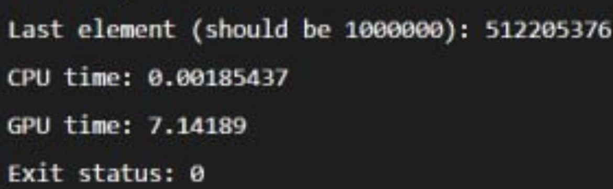
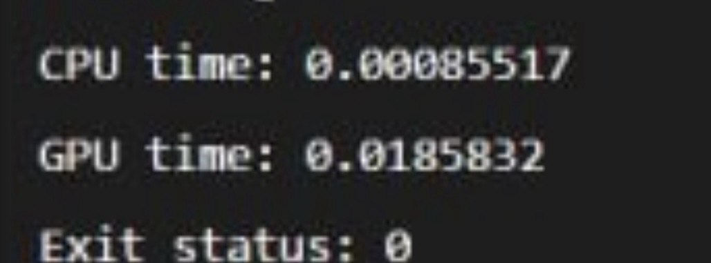
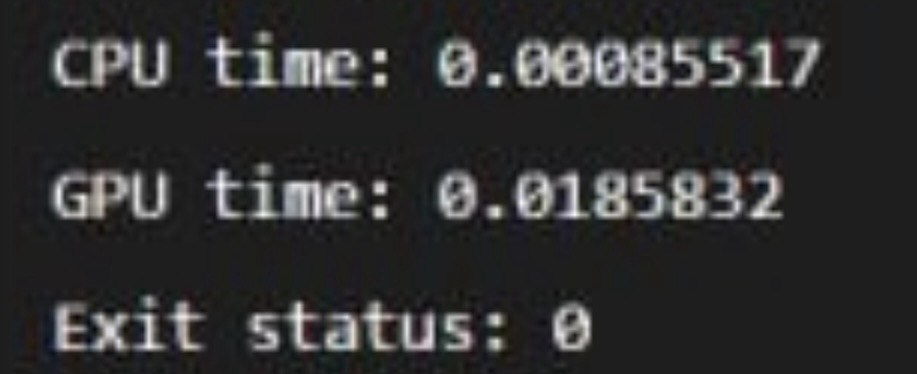
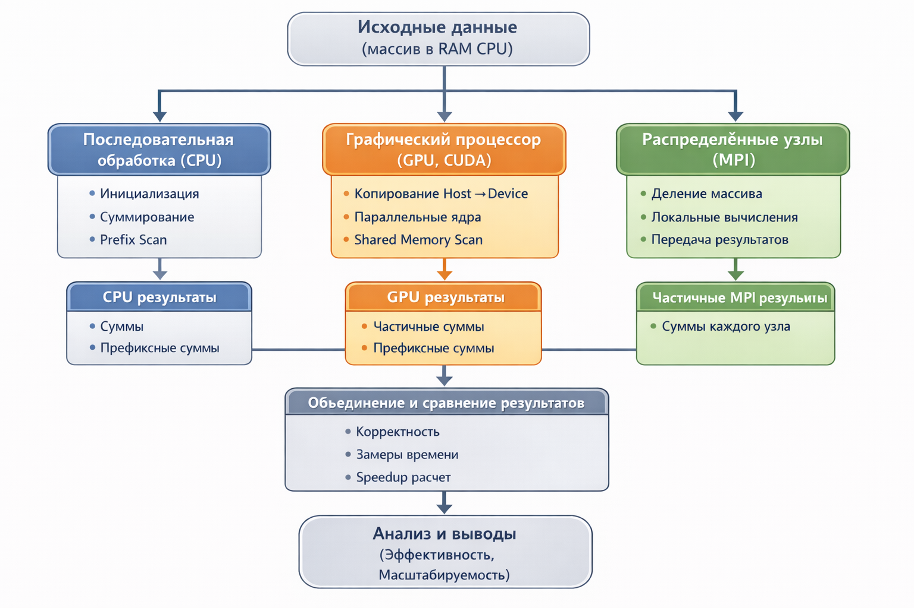

# Assignment 4  
## Hybrid and Distributed Parallel Computing

Данный проект посвящён исследованию гибридных и распределённых параллельных вычислений с использованием CPU, GPU (CUDA) и MPI. В рамках работы реализованы и сравнены различные подходы к обработке массивов данных с точки зрения производительности и масштабируемости.

Проект включает следующие вычислительные модели:
- последовательная обработка на CPU;
- массово-параллельная обработка на GPU с использованием CUDA;
- гибридная обработка CPU + GPU;
- распределённые вычисления с использованием MPI.

---

## Описание реализованных компонентов

### 1. Последовательная и GPU-версия суммирования
Выполняется суммирование элементов массива на CPU и на GPU. GPU-версия использует параллельную редукцию в глобальной и разделяемой памяти.

### 2. Префиксная сумма (scan)
Реализован параллельный алгоритм prefix sum на GPU с использованием shared memory. Также реализована последовательная версия на CPU для сравнения времени выполнения.

### 3. Гибридная обработка CPU + GPU
Массив делится на две части:
- первая половина обрабатывается на GPU,
- вторая половина обрабатывается на CPU.
Обе части вычисляются параллельно, что позволяет использовать оба вычислительных ресурса.

### 4. Распределённые вычисления (MPI)
Массив делится между процессами MPI. Каждый процесс вычисляет сумму своей части массива, после чего результаты объединяются с помощью `MPI_Reduce`.

---

## Запуск программ

### CUDA программы (task1.cu, task2.cu, task3.cu)
nvcc task1.cu -o task1
./task1

nvcc task2.cu -o task2
./task2

nvcc task3.cu -o task3
./task3

### MPI программа

mpic++ task4.cpp -o task4
mpirun -np 2 task4
mpirun -np 4 task4
mpirun -np 8 task4

---

### MPI программа
Результаты

Задание 1

  

 
Задание 2

  

Задание 3

  

---

## Блок-схема

  

---
## Контрольные вопросы

### 1. В чём заключается отличие гибридных вычислений от вычислений только на CPU или только на GPU?  
Гибридные вычисления используют одновременно CPU и GPU. CPU выполняет часть вычислений и управляет логикой программы, а GPU выполняет массово-параллельные операции. Это позволяет задействовать сильные стороны обеих архитектур, тогда как использование только CPU или только GPU ограничивает производительность.

### 2. Для каких типов задач целесообразно распределять вычисления между CPU и GPU?  
Гибридный подход эффективен для задач, в которых есть как последовательная логика, так и большие массивы однотипных операций. Например, предобработка данных и управление может выполняться на CPU, а численные вычисления — на GPU.

### 3. В чём разница между синхронной и асинхронной передачей данных между CPU и GPU?  
Синхронная передача блокирует выполнение программы до завершения копирования данных. Асинхронная передача позволяет выполнять вычисления параллельно с копированием, не останавливая выполнение CPU или GPU.

### 4. Почему асинхронная передача данных может повысить производительность программы?  
Асинхронная передача позволяет перекрывать вычисления и передачу данных, уменьшая простои GPU и CPU. Это повышает общее использование ресурсов и уменьшает общее время выполнения программы.

### 5. Какие основные функции MPI используются для распределения и сбора данных между процессами?  
Основные функции:
- `MPI_Comm_size` — определяет количество процессов;
- `MPI_Comm_rank` — определяет номер процесса;
- `MPI_Reduce` — объединяет результаты от всех процессов;
- `MPI_Scatter` и `MPI_Gather` — распределяют и собирают данные.

### 6. Как количество процессов MPI влияет на время выполнения программы и почему?  
При увеличении числа процессов нагрузка распределяется между большим количеством вычислительных узлов, что снижает время выполнения. Однако после определённого момента выигрыш уменьшается из-за затрат на коммуникацию между процессами.

### 7. Какие факторы ограничивают масштабируемость распределённых параллельных программ?  
Основные факторы: задержки сети, объём передаваемых данных, синхронизация между процессами и неравномерная нагрузка (load imbalance).

### 8. В каких случаях использование распределённых вычислений оправдано, а в каких — неэффективно?  
Распределённые вычисления оправданы для больших объёмов данных и длительных вычислений. Они неэффективны для небольших задач, где накладные расходы на передачу данных превышают выигрыш от параллелизма.

---

