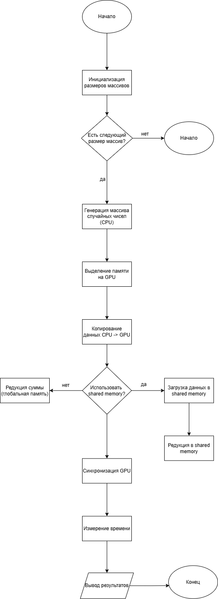
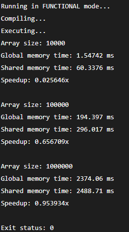

# Практическая работа №4  
## Оптимизация параллельного кода на GPU с использованием различных типов памяти CUDA

---

## Цель работы
Изучение различных типов памяти CUDA (глобальной, разделяемой и локальной)  
и анализ их влияния на производительность параллельных вычислений на GPU.

---

## Блок схема

  

---

## Краткое описание реализации

### 1. Глобальная память
Глобальная память используется для хранения основного массива данных и итогового результата.  
Доступ к ней имеют все потоки GPU, однако она обладает высокой задержкой.

В первом варианте редукции каждый поток напрямую читает данные из глобальной памяти и использует атомарную операцию `atomicAdd`, что приводит к снижению производительности.

---

### 2. Разделяемая память
Во втором варианте редукции данные сначала копируются из глобальной памяти в разделяемую память блока.  
Редукция суммы выполняется внутри блока, что позволяет значительно сократить количество обращений к глобальной памяти.

Разделяемая память используется для хранения промежуточных результатов.

---

### 3. Локальная память
Локальная память применяется при сортировке подмассивов.  
Каждый поток копирует небольшой участок данных в локальный массив и выполняет пузырьковую сортировку.

Локальная память используется для временных переменных и доступна только одному потоку.

---

## Результаты
Эксперимент показал, что использование разделяемой памяти ускоряет выполнение редукции суммы по сравнению с вариантом, использующим только глобальную память.  
Ускорение увеличивается с ростом размера массива.

  

---

## Контрольные вопросы

### 1. Чем отличаются типы памяти в CUDA и в каких случаях их использовать?

В CUDA существует несколько типов памяти, отличающихся скоростью доступа и областью видимости:

- **Глобальная память**  
  Доступна всем потокам, но имеет высокую задержку.  
  Используется для хранения больших массивов данных.

- **Разделяемая память**  
  Общая для потоков одного блока, обладает высокой скоростью доступа.  
  Используется для хранения промежуточных результатов и обмена данными между потоками блока.

- **Локальная память**  
  Доступна только одному потоку и используется для временных переменных.  
  Быстрая, но ограничена по объёму.

---

### 2. Как использование разделяемой памяти влияет на производительность?

Использование разделяемой памяти позволяет:
- сократить количество обращений к глобальной памяти;
- уменьшить задержки доступа к данным;
- повысить пропускную способность вычислений.

В результате производительность параллельных алгоритмов значительно возрастает, особенно при редукциях и обработке массивов.

---

### 3. Доступ к памяти и как его обеспечить?

Для корректного и эффективного доступа к памяти необходимо:
- проверять границы массива (`if (idx < n)`),
- синхронизировать потоки при работе с разделяемой памятью с помощью `__syncthreads()`,
- минимизировать одновременные атомарные операции,
- использовать согласованный (coalesced) доступ к глобальной памяти.

---

### 4. Какие сложности возникают при работе с большим объёмом данных на GPU?

Основные сложности:
- ограниченный объём памяти GPU;
- высокая задержка доступа к глобальной памяти;
- необходимость правильной организации потоков и блоков;
- затраты времени на копирование данных между CPU и GPU.

---

### 5. Почему важно минимизировать доступ к глобальной памяти?

Глобальная память является самой медленной памятью GPU.  
Частые обращения к ней существенно снижают производительность программы.  
Использование разделяемой и локальной памяти позволяет уменьшить задержки и повысить эффективность вычислений.

---

### 6. Как использовать профилирование для анализа производительности CUDA-программ?

Профилирование позволяет:
- определить узкие места в программе;
- измерить время выполнения kernel-функций;
- проанализировать использование памяти и загрузку GPU.

Для профилирования CUDA-программ можно использовать:
- **NVIDIA Nsight Systems**
- **NVIDIA Nsight Compute**
- встроенные средства замера времени (`cudaDeviceSynchronize` + таймеры).

