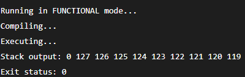
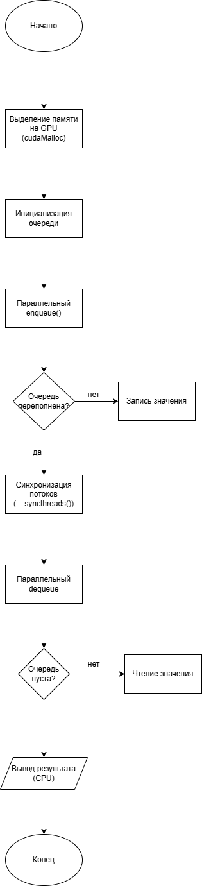
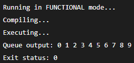

# Практическая работа №5  
## Реализация параллельных структур данных на GPU

---

## Цель работы
1. Освоить программирование параллельных структур данных с использованием CUDA.
2. Реализовать параллельные структуры данных: стек и очередь.
3. Проверить корректность работы и проанализировать особенности
параллельного доступа к данным на GPU.

---

## Теоретическая часть

### Параллельные структуры данных
Параллельные структуры данных предназначены для безопасной работы с данными
в условиях одновременного доступа нескольких потоков.  
При их реализации необходимо учитывать проблемы синхронизации и конфликтов
при доступе к общей памяти.

Основные структуры данных:
- **Стек (LIFO)** — добавление и удаление элементов происходит с одного конца.
- **Очередь (FIFO)** — добавление элементов происходит в конец, а удаление — из начала.

Параллельные структуры данных применяются в:
- буферизации данных,
- задачах планирования (task scheduling),
- обработке потоков данных на GPU.

---

## Практическая часть

### Часть 1. Параллельный стек (Stack)

В данной части был реализован параллельный стек с использованием атомарных
операций CUDA.  
Для синхронизации доступа к вершине стека применяются `atomicAdd` и `atomicSub`.

  

**Результат выполнения:**

  

Полученный результат подтверждает корректную работу стека:
- элементы извлекаются в порядке **LIFO**,
- последний добавленный элемент извлекается первым,
- атомарные операции обеспечивают корректный доступ при параллельном выполнении.

### Часть 2. Параллельная очередь (Queue)

Во второй части была реализована параллельная очередь с использованием
атомарных операций для управления указателями `head` и `tail`.

  

**Результат выполнения:**

  

Результат показывает, что:
- элементы извлекаются в порядке **FIFO**,
- порядок добавления и удаления сохраняется,
- очередь корректно работает при параллельном доступе.

---

## Контрольные вопросы

### 1. В чём отличие стека и очереди?
Стек работает по принципу **LIFO** (последний пришёл — первый вышел),  
а очередь по принципу **FIFO** (первый пришёл — первый вышел).  
В стеке все операции выполняются с одного конца, а в очереди
добавление и удаление происходят с разных концов.

---

### 2. Какие проблемы возникают при параллельном доступе к данным?
Основные проблемы:
- состояния гонки,
- потеря данных,
- некорректный порядок операций,
- одновременная запись в одну и ту же область памяти.

---

### 3. Как атомарные операции помогают избежать конфликтов в параллельных структурах данных?
Атомарные операции гарантируют, что операция над данными выполняется
целиком и не может быть прервана другим потоком.  
Это позволяет корректно обновлять общие переменные, такие как указатели
вершины стека или границы очереди.

---

### 4. Какие типы памяти CUDA используются для хранения данных?
В CUDA используются:
- **глобальная память** — доступна всем потокам, но медленная;
- **разделяемая память** — быстрая память внутри блока потоков;
- **локальная память** — используется для временных данных одного потока.

---

### 5. Как синхронизация потоков влияет на производительность?
Синхронизация необходима для корректности, но она снижает производительность,
так как потоки вынуждены ждать друг друга.  
Поэтому важно использовать синхронизацию только там, где она действительно нужна.

---

### 6. Почему разделяемая память важна для оптимизации работы параллельных структур данных?
Разделяемая память имеет меньшую задержку по сравнению с глобальной памятью.
Использование разделяемой памяти позволяет сократить количество обращений
к глобальной памяти и повысить общую производительность параллельных алгоритмов.