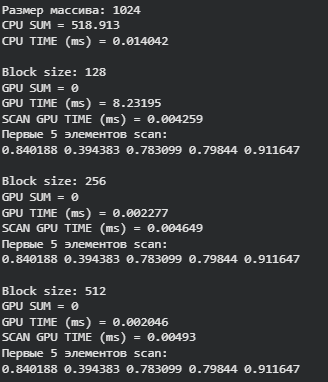
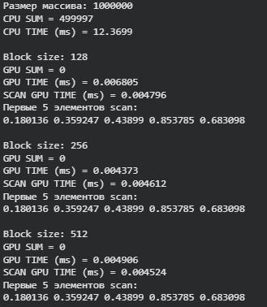
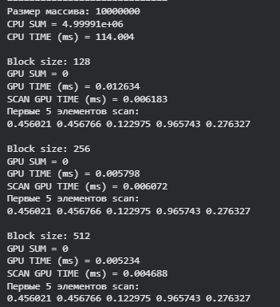
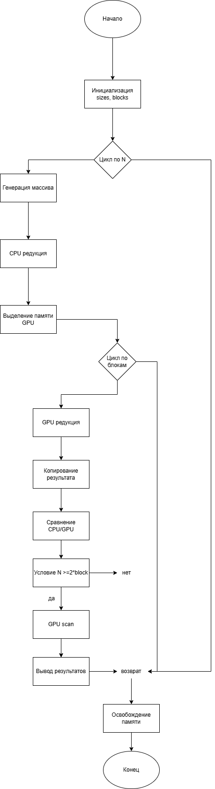

# Практическая работа №7  
## Редукция и сканирование на GPU (CUDA)

---

## Цель работы

Целью данной практической работы является изучение и реализация параллельных алгоритмов редукции и сканирования (префиксной суммы) на графическом процессоре с использованием технологии CUDA. Также в работе проводится анализ производительности данных алгоритмов и сравнение с CPU-реализацией.

---
## Практическая часть

### Задание 1: Реализация редукции

Было реализовано CUDA-ядро для выполнения редукции (суммирования элементов массива). Внутри каждого блока используется разделяемая память, что уменьшает количество обращений к глобальной памяти и повышает производительность.

Корректность работы проверялась путём сравнения результатов GPU и CPU реализаций.

---

### Задание 2: Реализация префиксной суммы

Для вычисления префиксной суммы был реализован алгоритм **Blelloch Scan**. Алгоритм состоит из двух фаз:

- **Up-sweep** — построение дерева сумм.  
- **Down-sweep** — распространение накопленных значений.  

Реализация выполнена с использованием shared memory и корректно работает для одного блока размером `2 * blockDim.x`.

---

### Задание 3: Анализ производительности

В работе измерялось время выполнения редукции и сканирования для массивов разных размеров:

- 1024 элементов  
- 1 000 000 элементов  
- 10 000 000 элементов  

Также проводилось сравнение с CPU-реализацией и исследовалось влияние размера блока.

---

## Результаты экспериментов
### Размер массива: 1024

---
### Размер массива: 1 000 000

### Размер массива: 10 000 000

По результатам экспериментов можно сделать следующие выводы:

1. GPU значительно превосходит CPU по скорости выполнения редукции при больших размерах массива.  
2. При увеличении размера массива разница между CPU и GPU становится особенно заметной.  
3. Размер блока влияет на производительность: в большинстве случаев оптимальными оказались значения 256 и 512.  
4. Использование разделяемой памяти позволяет существенно сократить время выполнения.  

Сканирование (Blelloch Scan) демонстрирует стабильное и быстрое время работы, так как выполняется внутри одного блока.

## Блок-схема

## Выводы

В ходе выполнения практической работы были реализованы и протестированы параллельные алгоритмы редукции и сканирования на GPU с использованием CUDA. Экспериментально подтверждено, что:

- GPU обеспечивает значительный прирост производительности по сравнению с CPU.  
- Разделяемая память является ключевым фактором оптимизации.  
- Алгоритмы редукции и сканирования особенно эффективны для обработки больших массивов данных.  

Полученные результаты демонстрируют преимущества параллельных вычислений и актуальность использования GPU в вычислительно сложных задачах.

---

## Контрольные вопросы

**1. В чём разница между редукцией и сканированием?**  
Редукция сводит массив к одному значению, а сканирование вычисляет накопленное значение для каждого элемента.

**2. Какие типы памяти CUDA используются для оптимизации?**  
Глобальная память, разделяемая память и локальная память.

**3. Как можно оптимизировать префиксную сумму на GPU?**  
Использовать алгоритмы типа Blelloch Scan, shared memory и многоуровневую обработку блоков.

**4. Пример задачи со сканированием:**  
Построение гистограммы, сортировка, вычисление префиксных сумм в графах.
