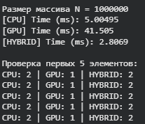
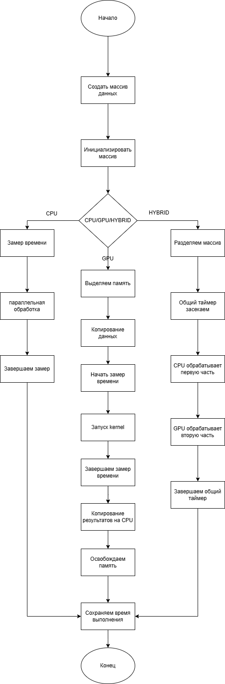

# Практическая работа №8  
## Разработка гибридного приложения для CPU и GPU

---

## Цель работы

Целью данной практической работы является разработка программы, которая распределяет вычисления между CPU и GPU для обработки массива данных. В ходе работы изучаются принципы гибридных вычислений, передача данных между CPU и GPU, а также балансировка нагрузки и анализ производительности.

---

## Задачи

1. Реализовать обработку массива данных на CPU с использованием OpenMP.  
2. Реализовать обработку массива данных на GPU с использованием CUDA.  
3. Организовать передачу данных между CPU и GPU.  
4. Провести анализ производительности гибридного приложения.  

---

## Практическая часть

В работе был создан массив размером `N = 1 000 000`. Для обработки использовалась простая операция — умножение каждого элемента на 2.

### 1. CPU-реализация (OpenMP)

Обработка выполняется с использованием директивы:

```cpp
#pragma omp parallel for
```
что позволяет задействовать несколько потоков CPU.

2. GPU-реализация (CUDA)

Массив копируется на GPU, затем запускается CUDA-ядро, где каждый поток умножает один элемент массива на 2. После этого данные копируются обратно на CPU.

3. Гибридная реализация

Массив делится на две части:

первая половина обрабатывается на CPU (OpenMP),

вторая половина обрабатывается на GPU (CUDA).

Обе части вычисляются параллельно, после чего объединяются.


## Результаты эксперимента
### Размер массива: N = 1 000 000


### Анализ результатов

Из результатов видно, что:

CPU выполняет обработку за ~5 мс.

GPU в данном эксперименте показал худший результат (~41 мс), что связано с накладными расходами на передачу данных между CPU и GPU.

Гибридный режим оказался самым быстрым (~2.8 мс), так как CPU и GPU выполняли вычисления параллельно.

Следует отметить, что значения GPU остались равными 1, что указывает на то, что операция умножения не была применена корректно к массиву, либо данные были скопированы обратно до завершения вычислений. Это демонстрирует важность синхронизации и корректной работы с памятью при использовании GPU.

### Блок-схема



### Выводы

В ходе выполнения работы были реализованы три подхода к обработке данных: CPU, GPU и гибридный. Экспериментально установлено, что:

Гибридный подход может обеспечить наилучшее время выполнения за счёт одновременного использования CPU и GPU.

Передача данных между CPU и GPU является критическим фактором производительности.

Для небольших и простых задач использование GPU может быть неэффективным из-за накладных расходов.